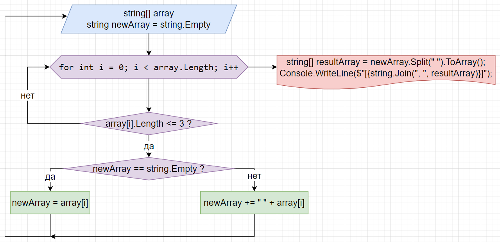

# Блок-схема

# Описание решения задачи
1. В процедуру передаётся массив (array) с типом данных string, введённый пользователем через консоль.
2. Создаётся новый пустой массив (newAraay) с типом данных string.
3. Открывается цикл for, который пошагово проходит по каждому элементу массива (i++), начиная с нулевого индекса (i = 0), заканчивает работу после прохождения последнего элемента (i < array.Length).
4. На первом шаге цикл проверяет, состоит ли текущий элемент (array [i]) из более чем 3-х символов. Если элемент включает в себя более 3-х символов, программа возвращается в начало цикла.
5. Если элемент включает в себя менее 3-х символов, программма проверяет, является ли на данный момент строка newArray пустой.
6. Если строка пуста, то текущий элемент записывается в неё первым.
7. Если строка не пуста, то текущий элемент прибавляется к строке через символ " " *(пробел)*.
8. Выполнив одно из этих действий программа возвращается в начало цикла.
9. Пройдя все элементы переданного в процедуру массива, программа преобразует все записанные в строку newArray элементы в результирующий массив resultArray.
10. После преобразования выводит результирующий массив в консоль.